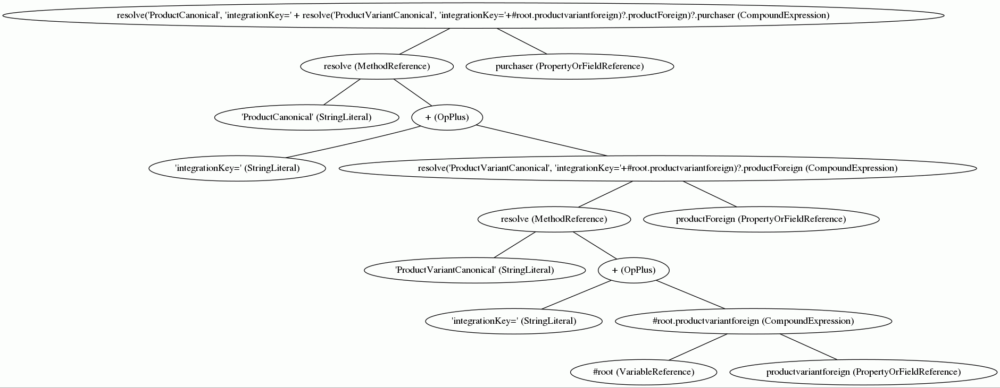

##Some Spel Stuff

Worth mentioning may be the graphviz-dot-file generator for Spring spel expressions. 

Change into the project directory 'springstuff' and run ...

```
mvn package
cd /spelstuff/target 
java -jar spel.dot-1.0-SNAPSHOT.jar "resolve('ProductCanonical', 'integrationKey=' + resolve('ProductVariantCanonical', 'integrationKey='+#root.productvariantforeign)?.productForeign)?.purchaser"
```
you should see this output:

```
graph g{

N0 -- {N1; N14}
N1 -- {N2; N3}
N3 -- {N4; N5}
N5 -- {N6; N13}
N6 -- {N7; N8}
N8 -- {N9; N10}
N10 -- {N11; N12}

N0 [label="resolve('ProductCanonical', 'integrationKey=' + resolve('ProductVariantCanonical', 'integrationKey='+#root.productvariantforeign)?.productForeign)?.purchaser (CompoundExpression)"]
N1 [label="resolve (MethodReference)"]
N2 [label="'ProductCanonical' (StringLiteral)"]
N3 [label="+ (OpPlus)"]
N4 [label="'integrationKey=' (StringLiteral)"]
N5 [label="resolve('ProductVariantCanonical', 'integrationKey='+#root.productvariantforeign)?.productForeign (CompoundExpression)"]
N6 [label="resolve (MethodReference)"]
N7 [label="'ProductVariantCanonical' (StringLiteral)"]
N8 [label="+ (OpPlus)"]
N9 [label="'integrationKey=' (StringLiteral)"]
N10 [label="#root.productvariantforeign (CompoundExpression)"]
N11 [label="#root (VariableReference)"]
N12 [label="productvariantforeign (PropertyOrFieldReference)"]
N13 [label="productForeign (PropertyOrFieldReference)"]
N14 [label="purchaser (PropertyOrFieldReference)"]

}
```

Get it somehow into a file (spel.dot, say) and run

`dot -Tgif spel.dot -o spel.gif`

which, when viewed, should look like this


